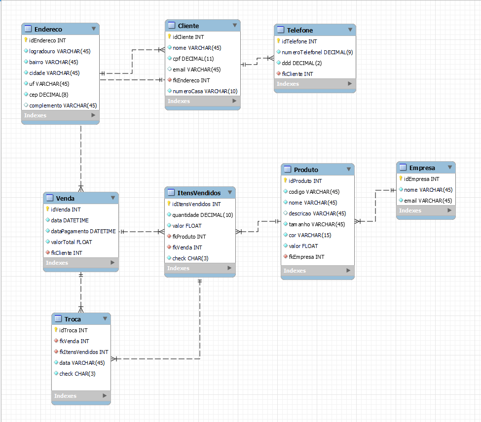
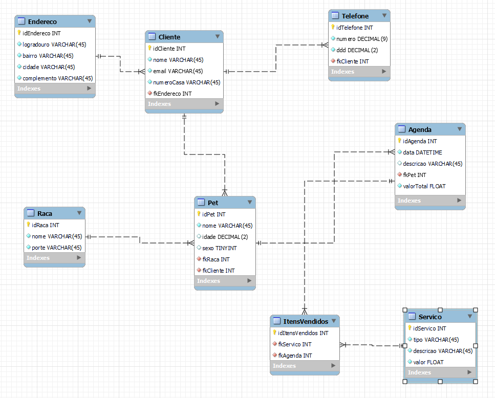
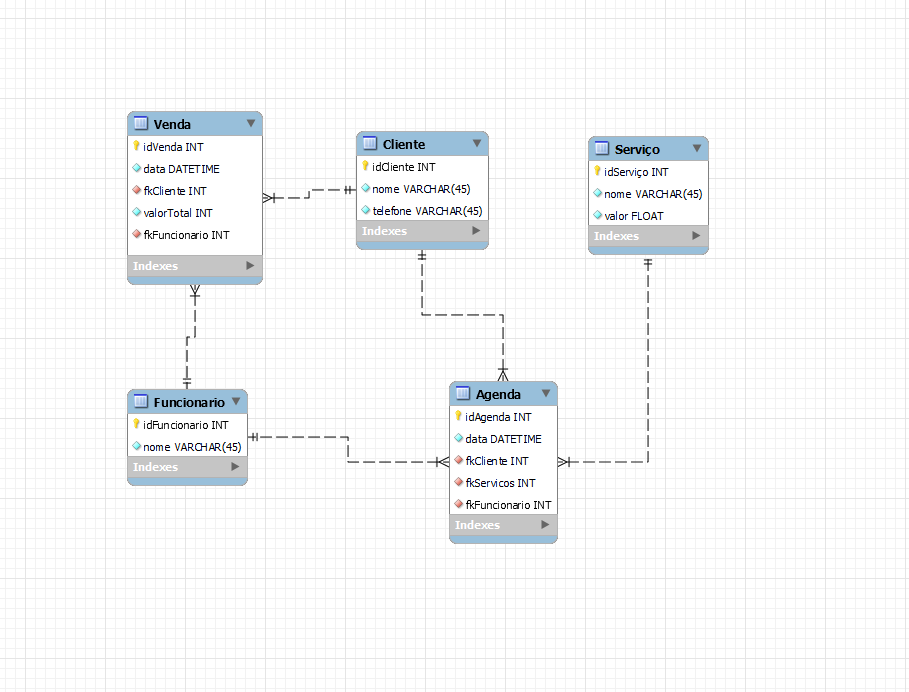
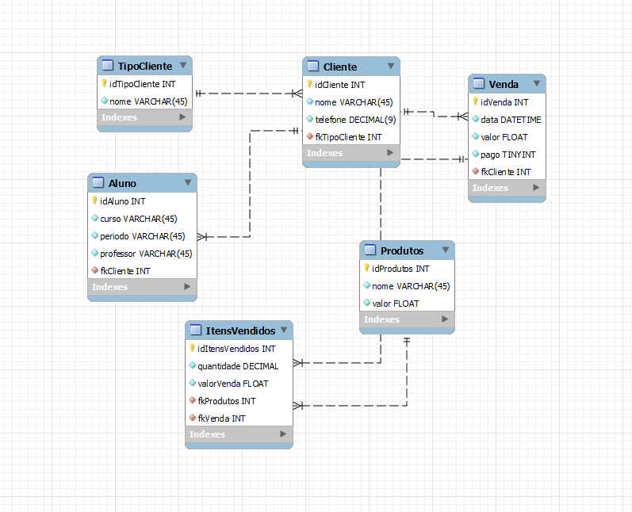

# MySQLworkbench

## Modelagem de quatro bancos de dados MySQL.
- Agenda
<h2 align="center">
  

</h2>

- Banho e tosa
<h2 align="center">
  

</h2>

- Barbearia
<h2 align="center">
  

</h2>

- Salgados
<h2 align="center">
  

</h2>

